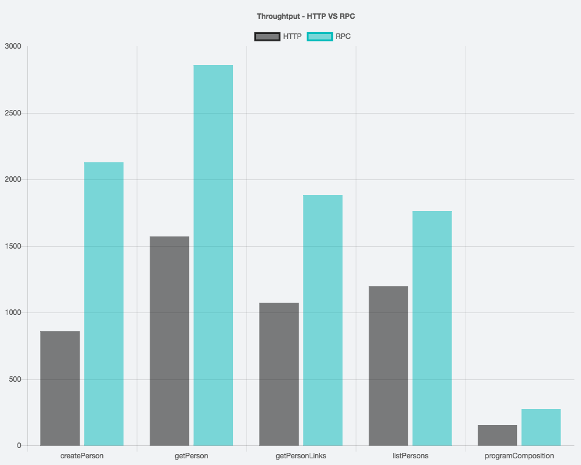

[](https://travis-ci.com/47deg/metrifier)

# metrifier

Comparing `HTTP` against `frees-rpc` services.

## Running Demo

### http

* Run Server:

```bash
sbt "http/runMain metrifier.http.server.HttpServer"
```

* Run Client:

```bash
sbt "demo/runMain metrifier.demo.HttpDemoApp"
```

By default, host and port will be `localhost` and `8080`, respectively. You can override this configuration through either configuration key or environment variable:

* Host: `http.host` VS `HTTP_HOST`.
* Port: `http.port` VS `HTTP_PORT`.

### frees-rpc

* Run Server:

```bash
sbt "frees-rpc/runMain metrifier.rpc.server.RPCServer"
```

* Run Client:

```bash
sbt "demo/runMain metrifier.demo.RPCDemoApp"
```

By default, host and port will be `localhost` and `8080`, respectively. You can override this configuration through either configuration key or environment variable:

* Host: `rpc.host` VS `RPC_HOST`.
* Port: `rpc.port` VS `RPC_PORT`.

## Running Benchmarks

We are using the [Java Microbenchmark Harness (JMH)](http://openjdk.java.net/projects/code-tools/jmh/) tool, which is helping us to get an experimental answer to a basic question about which implementation executes fastest among:

* HTTP stack based on:
  * `http4s`, version `0.15.12a`.
  * `argonaut`, version `6.2`.
* RPC services stack based on:
  * `freestyle`, version `0.4.1`.
  * `frees-rpc`, version `0.1.2` (atop of [gRPC](https://grpc.io/), version `1.6.1`).

### http

* Run Server:

```bash
sbt "http/runMain metrifier.http.server.HttpServer"
```

* Run Benchmarks:

```bash
sbt "bench/jmh:run -o http-benchmark-results.txt -i 20 -wi 20 -f 2 -t 1 metrifier.benchmark.HttpBenchmark"
```

Which means "20 iterations", "20 warmup iterations", "2 forks", "1 thread".

### frees-rpc

* Run Server:

```bash
sbt "frees-rpc/runMain metrifier.rpc.server.RPCServer"
```

* Run Benchmarks:

```bash
sbt "bench/jmh:run -o rpc-benchmark-results.txt -i 20 -wi 20 -f 2 -t 1 metrifier.benchmark.RPCBenchmark"
```

Which means "20 iterations", "20 warmup iterations", "2 forks", "1 thread".

### Benchmark Results

Expanded version is in the [BENCHMARK_RESULTS.md](BENCHMARK_RESULTS.md) file.

#### Machine Details

* Model Name: MacBook Pro
* Model Identifier: MacBookPro12,1
* Intel(R) Core(TM) i5-5257U CPU @ 2.70GHz
* Number of Processors: 1
* Total Number of Cores: 2
* L2 Cache (per Core): 256 KB
* L3 Cache: 3 MB
* Memory: 16 GB

#### http vs frees-rpc summary

* HttpBenchmark Raw output:

```bash
# Run complete. Total time: 00:08:52

Benchmark                          Mode  Cnt     Score     Error  Units
HttpBenchmark.createPerson        thrpt   40   861.052 ± 106.109  ops/s
HttpBenchmark.getPerson           thrpt   40  1569.770 ± 153.491  ops/s
HttpBenchmark.getPersonLinks      thrpt   40  1072.277 ± 131.565  ops/s
HttpBenchmark.listPersons         thrpt   40  1196.642 ± 153.626  ops/s
HttpBenchmark.programComposition  thrpt   40   156.592 ±  14.936  ops/s
```

* RPCBenchmark Raw output:

```bash
# Run complete. Total time: 00:09:32

Benchmark                         Mode  Cnt     Score     Error  Units
RPCBenchmark.createPerson        thrpt   40  2127.367 ± 230.981  ops/s
RPCBenchmark.getPerson           thrpt   40  2859.026 ± 205.242  ops/s
RPCBenchmark.getPersonLinks      thrpt   40  1883.806 ± 127.808  ops/s
RPCBenchmark.listPersons         thrpt   40  1762.097 ± 161.918  ops/s
RPCBenchmark.programComposition  thrpt   40   272.358 ±  18.218  ops/s
```

##### Summary

###### **createPerson**

Source | Mode | Cnt | Score | Error | Units
--- | --- | --- | --- | --- | ---
HttpBenchmark.createPerson | thrpt | 40 | 861.052 | 106.109 | ops/s
RPCBenchmark.createPerson | thrpt | 40 | 2127.367 | 230.981 | ops/s

###### **getPerson**

Source | Mode | Cnt | Score | Error | Units
--- | --- | --- | --- | --- | ---
HttpBenchmark.getPerson | thrpt | 40 | 1569.770 | 153.491 | ops/s
RPCBenchmark.getPerson | thrpt | 40 | 2859.026 | 205.242 | ops/s

###### **getPersonLinks**

Source | Mode | Cnt | Score | Error | Units
--- | --- | --- | --- | --- | ---
HttpBenchmark.getPersonLinks | thrpt | 40 | 1072.277 | 131.565 | ops/s
RPCBenchmark.getPersonLinks | thrpt | 40 | 1883.806 | 127.808 | ops/s

###### **listPersons**

Source | Mode | Cnt | Score | Error | Units
--- | --- | --- | --- | --- | ---
HttpBenchmark.listPersons | thrpt | 40 | 1196.642 | 153.626 | ops/s
RPCBenchmark.listPersons | thrpt | 40 | 1762.097 | 161.918 | ops/s

###### **programComposition**

Source | Mode | Cnt | Score | Error | Units
--- | --- | --- | --- | --- | ---
HttpBenchmark.programComposition | thrpt | 40 | 156.592 |  14.936 | ops/s
RPCBenchmark.programComposition | thrpt | 40 | 272.358 |  18.218 | ops/s

##### Comparing both in Charts

You can find the following charts in [this jsfiddle](http://jsfiddle.net/juanpedromoreno/sjw5jgrj/).

* Bar Chart


* Radar Chart


#### Conclusion

Using JMH, we have checked out quickly the performance characteristics for both service architectures, and we can say that the RPC approach is noticeably faster.

## Assembling metrifier

To make a JAR file containing only the external dependencies, type:

```bash
sbt assemblyPackageDependency
```

Output (assuming we are in the project path):

```bash
bench/target/scala-2.12/metrifier-bench-assembly-0.0.2-deps.jar
bench/target/scala-2.12/metrifier-demo-assembly-0.0.2-deps.jar
bench/target/scala-2.12/metrifier-frees-rpc-assembly-0.0.2-deps.jar
bench/target/scala-2.12/metrifier-http-assembly-0.0.2-deps.jar
bench/target/scala-2.12/metrifier-shared-assembly-0.0.2-deps.jar
```

This is intended to be used with a JAR that only contains your project, so now, you can write:

```bash
sbt assembly
```

And we'll get the following artifacts as the result:

```bash
bench/target/scala-2.12/metrifier-bench-assembly-0.0.2.jar
bench/target/scala-2.12/metrifier-demo-assembly-0.0.2.jar
bench/target/scala-2.12/metrifier-frees-rpc-assembly-0.0.2.jar
bench/target/scala-2.12/metrifier-http-assembly-0.0.2.jar
bench/target/scala-2.12/metrifier-shared-assembly-0.0.2.jar
```

## Running in Google Cloud Platform

See [this guide](deploy/README.md) to get information about how to deploy the different services in [Google Compute Engine](https://cloud.google.com/compute/).

### Running the HTTP Server

1. SSH into `http-server-vm` instance.
2. Clone the project:
```bash
git clone https://github.com/47deg/metrifier.git && cd metrifier
```
3. Run the HTTP Server:
```bash
sbt "http/runMain metrifier.http.server.HttpServer"
```

### Chek out the HTTP Server

1. SSH into `http-jmh-vm` instance.
2. Clone the project:
```bash
git clone https://github.com/47deg/metrifier.git && cd metrifier
```
3. Run the following `GET` to fetch all the persons (replace `[INTERNAL_IP]` with the internal IP address asigned to the `http-jmh-vm` instance):
```bash
curl "http://[INTERNAL_IP]:8080/person"
```