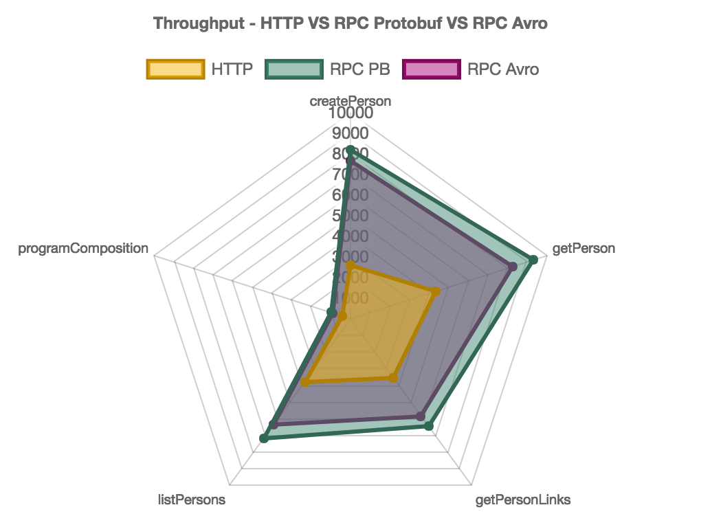

[](https://travis-ci.org/47deg/metrifier)

# metrifier

Comparing `HTTP` against `mu-rpc` services.

<!-- START doctoc generated TOC please keep comment here to allow auto update -->
<!-- DON'T EDIT THIS SECTION, INSTEAD RE-RUN doctoc TO UPDATE -->
**Table of Contents**  *generated with [DocToc](https://github.com/thlorenz/doctoc)*

- [Running Demo](#running-demo)
  - [http](#http)
  - [mu-rpc](#mu-rpc)
    - [mu-rpc Protobuf](#mu-rpc-protobuf)
    - [mu-rpc Avro](#mu-rpc-avro)
- [Running Benchmarks Locally](#running-benchmarks-locally)
  - [HTTP Benchmarks](#http-benchmarks)
  - [mu-rpc Protobuf Benchmarks](#mu-rpc-protobuf-benchmarks)
  - [mu-rpc Avro Benchmarks](#mu-rpc-avro-benchmarks)
- [Running Benchmarks on Google Cloud Platform](#running-benchmarks-on-google-cloud-platform)
  - [Assembling metrifier](#assembling-metrifier)
  - [Uploading jars to Google Cloud Storage](#uploading-jars-to-google-cloud-storage)
  - [Provisioning the Infrastructure](#provisioning-the-infrastructure)
  - [HTTP Benchmarks](#http-benchmarks-1)
    - [Running the Server](#running-the-server)
    - [Running the Benchmarks](#running-the-benchmarks)
  - [mu-rpc Proto Benchmarks](#mu-rpc-proto-benchmarks)
    - [Running the Server](#running-the-server-1)
    - [Running the Benchmarks](#running-the-benchmarks-1)
  - [mu-rpc Avro Benchmarks](#mu-rpc-avro-benchmarks-1)
    - [Running the Server](#running-the-server-2)
    - [Running the Benchmarks](#running-the-benchmarks-2)
- [Benchmark Results](#benchmark-results)
  - [Running Benchmarks Locally](#running-benchmarks-locally-1)
    - [Machine Details](#machine-details)
    - [HTTP vs mu-rpc Protobuf vs mu-rpc Avro](#http-vs-mu-rpc-protobuf-vs-mu-rpc-avro)
    - [Comparing benchmarks one by one](#comparing-benchmarks-one-by-one)
      - [createPerson](#createperson)
      - [getPerson](#getperson)
      - [getPersonLinks](#getpersonlinks)
      - [listPersons](#listpersons)
      - [programComposition](#programcomposition)
    - [Comparing benchmarks in Charts](#comparing-benchmarks-in-charts)
  - [Running Benchmarks on GCP](#running-benchmarks-on-gcp)
    - [Server GCE instance Details](#server-gce-instance-details)
    - [Benchmarks GCE instance Details](#benchmarks-gce-instance-details)
    - [HTTP vs mu-rpc Protobuf vs mu-rpc Avro](#http-vs-mu-rpc-protobuf-vs-mu-rpc-avro-1)
    - [Comparing benchmarks one by one](#comparing-benchmarks-one-by-one-1)
      - [createPerson](#createperson-1)
      - [getPerson](#getperson-1)
      - [getPersonLinks](#getpersonlinks-1)
      - [listPersons](#listpersons-1)
      - [programComposition](#programcomposition-1)
    - [Comparing benchmarks in Charts](#comparing-benchmarks-in-charts-1)
  - [Conclusion](#conclusion)

<!-- END doctoc generated TOC please keep comment here to allow auto update -->

## Running Demo

### http

* Run Server:

```bash
sbt "http/runMain metrifier.http.server.HttpServer"
```

* Run Client:

```bash
sbt "demo-http/runMain metrifier.demo.HttpDemoApp"
```

By default, host and port will be `localhost` and `8080`, respectively. You can override this configuration through either configuration key or environment variable:

* Host: `http.host` VS `HTTP_HOST`.
* Port: `http.port` VS `HTTP_PORT`.

### mu-rpc

In this case, we will try out with two different of binary serializations: `Protobuf` and `Avro`.

By default, for both cases, the host and the port will be `localhost` and `8080`, respectively. You can override this configuration through either configuration key or environment variable:

* Host: `rpc.host` VS `RPC_HOST`.
* Port: `rpc.port` VS `RPC_PORT`.

#### mu-rpc Protobuf

* Run **Protobuf** based Server:

```bash
sbt "mu-rpc/runMain metrifier.rpc.server.RPCProtoServer"
```

* Run **Protobuf** based Client:

```bash
sbt "demo-mu/runMain metrifier.demo.RPCProtoDemoApp"
```

#### mu-rpc Avro

* Run **Avro** based Server:

```bash
sbt "mu-rpc/runMain metrifier.rpc.server.RPCAvroServer"
```

* Run **Avro** based Client:

```bash
sbt "demo-mu/runMain metrifier.demo.RPCAvroDemoApp"
```

## Running Benchmarks Locally

We are using the [Java Microbenchmark Harness (JMH)](http://openjdk.java.net/projects/code-tools/jmh/) tool, which is helping us to get an experimental answer to a basic question about which implementation executes fastest among:

* HTTP stack based on:
  * `http4s`, version `0.20.10`.
  * `circe`, version `0.11.1`.
* RPC services stack based on:
  * `mu-rpc`, version `0.18.4` (atop of [gRPC](https://grpc.io/), version `1.18.0`).

### HTTP Benchmarks

* Run Server:

```bash
sbt "http/runMain metrifier.http.server.HttpServer"
```

* Run Benchmarks:

```bash
sbt "bench-http/jmh:run -o http-benchmark-results.txt -i 20 -wi 20 -f 2 -t 4 -r 1 -w 1 metrifier.benchmark.HttpBenchmark"
```

Which means "20 iterations", "20 warmup iterations", "2 forks", "4 threads". `r` and `w` are specifying the minimum time (seconds) to spend at each measurement warmup iteration/iteration.

### mu-rpc Protobuf Benchmarks

* Run Protobuf based Server:

```bash
sbt "mu-rpc/runMain metrifier.rpc.server.RPCProtoServer"
```

* Run Protobuf based Benchmarks:

```bash
sbt "bench-mu/jmh:run -o rpc-proto-benchmark-results.txt -i 20 -wi 20 -f 2 -t 4 -r 1 -w 1 metrifier.benchmark.RPCProtoBenchmark"
```

Which means "20 iterations", "20 warmup iterations", "2 forks", "4 threads". `r` and `w` are specifying the minimum time (seconds) to spend at each measurement warmup iteration/iteration.

### mu-rpc Avro Benchmarks

* Run Avro based Server:

```bash
sbt "mu-rpc/runMain metrifier.rpc.server.RPCAvroServer"
```

* Run Avro based Benchmarks:

```bash
sbt "bench-mu/jmh:run -o rpc-avro-benchmark-results.txt -i 20 -wi 20 -f 2 -t 4 -r 1 -w 1 metrifier.benchmark.RPCAvroBenchmark"
```

Which means "20 iterations", "20 warmup iterations", "2 forks", "4 threads". `r` and `w` are specifying the minimum time (seconds) to spend at each measurement warmup iteration/iteration.

## Running Benchmarks on Google Cloud Platform

Before starting detailing how to deploy metrifier to GCP, let's see how to assemble it.

### Assembling metrifier

To make a JAR file containing only the external dependencies, type:

```bash
sbt assemblyPackageDependency
```

Output (assuming we are in the project path):

```bash
bench/target/scala-2.12/metrifier-bench-assembly-[project-version]-deps.jar
demo/http/target/scala-2.12/metrifier-demo-http-assembly-[project-version-deps.jar
bench/mu/target/scala-2.12/metrifier-bench-mu-assembly-[project-version-deps.jar
demo/target/scala-2.12/metrifier-demo-assembly-[project-version]-deps.jar
bench/http/target/scala-2.12/metrifier-bench-http-assembly-[project-version-deps.jar
bench/mu/target/scala-2.12/metrifier-bench-mu-assembly-[project-version-deps.jar
mu-rpc/target/scala-2.12/metrifier-mu-rpc-assembly-[project-version]-deps.jar
http/target/scala-2.12/metrifier-http-assembly-[project-version]-deps.jar
shared/target/scala-2.12/metrifier-shared-assembly-[project-version]-deps.jar
```

This is intended to be used with a JAR that only contains your project, so now, you can write:

```bash
sbt "demo-http/assembly"
sbt "demo-mu/assembly"
```

And we'll get the following artifacts as the result:

```bash
demo/target/scala-2.12/metrifier-demo-assembly-[project-version].jar
demo/http/target/scala-2.12/metrifier-demo-assembly-[project-version].jar
demo/mu/target/scala-2.12/metrifier-demo-assembly-[project-version].jar
mu-rpc/target/scala-2.12/metrifier-mu-rpc-assembly-[project-version].jar
http/target/scala-2.12/metrifier-http-assembly-[project-version].jar
shared/target/scala-2.12/metrifier-shared-assembly-[project-version].jar
```

### Uploading jars to Google Cloud Storage

In this case, we've created a bucket named as `metrifier` within our GCP project. Assuming this name, these would be the set of commands to run (we're skipping the `bench` artifacts since we are not going to use them):

```bash
export METRIFIER_VERSION=0.1.0
gsutil cp demo/target/scala-2.12/metrifier-demo-assembly-${METRIFIER_VERSION}-deps.jar gs://metrifier/jars
gsutil cp demo/http/target/scala-2.12/metrifier-demo-assembly-${METRIFIER_VERSION}-deps.jar gs://metrifier/jars
gsutil cp demo/mu/target/scala-2.12/metrifier-demo-assembly-${METRIFIER_VERSION}-deps.jar gs://metrifier/jars
gsutil cp mu-rpc/target/scala-2.12/metrifier-mu-rpc-assembly-${METRIFIER_VERSION}-deps.jar gs://metrifier/jars
gsutil cp http/target/scala-2.12/metrifier-http-assembly-${METRIFIER_VERSION}-deps.jar gs://metrifier/jars
gsutil cp shared/target/scala-2.12/metrifier-shared-assembly-${METRIFIER_VERSION}-deps.jar gs://metrifier/jars
gsutil cp demo/target/scala-2.12/metrifier-demo-assembly-${METRIFIER_VERSION}.jar gs://metrifier/jars
gsutil cp demo/http/target/scala-2.12/metrifier-demo-assembly-${METRIFIER_VERSION}.jar gs://metrifier/jars
gsutil cp demo/mu/target/scala-2.12/metrifier-demo-assembly-${METRIFIER_VERSION}.jar gs://metrifier/jars
gsutil cp mu-rpc/target/scala-2.12/metrifier-mu-rpc-assembly-${METRIFIER_VERSION}.jar gs://metrifier/jars
gsutil cp http/target/scala-2.12/metrifier-http-assembly-${METRIFIER_VERSION}.jar gs://metrifier/jars
gsutil cp shared/target/scala-2.12/metrifier-shared-assembly-${METRIFIER_VERSION}.jar gs://metrifier/jars
```

If the project dependencies have not changed, you could just upload the project JARs:

```bash
export METRIFIER_VERSION=0.1.0
gsutil cp demo/target/scala-2.12/metrifier-demo-assembly-${METRIFIER_VERSION}.jar gs://metrifier/jars
gsutil cp demo/http/target/scala-2.12/metrifier-demo-assembly-${METRIFIER_VERSION}.jar gs://metrifier/jars
gsutil cp demo/mu/target/scala-2.12/metrifier-demo-assembly-${METRIFIER_VERSION}.jar gs://metrifier/jars
gsutil cp mu-rpc/target/scala-2.12/metrifier-mu-rpc-assembly-${METRIFIER_VERSION}.jar gs://metrifier/jars
gsutil cp http/target/scala-2.12/metrifier-http-assembly-${METRIFIER_VERSION}.jar gs://metrifier/jars
gsutil cp shared/target/scala-2.12/metrifier-shared-assembly-${METRIFIER_VERSION}.jar gs://metrifier/jars
```

### Provisioning the Infrastructure

See [this guide](deploy/README.md) to get information about how to deploy and to provision the different services in [Google Compute Engine](https://cloud.google.com/compute/).

Once everything is up, follow the next sections to run the benchmarks atop GCP.

### HTTP Benchmarks

#### Running the Server

1. SSH into `http-server-vm` instance.
2. Run the HTTP Server:
```bash
export METRIFIER_VERSION=0.1.0
env \
    HTTP_HOST=http-server-vm \
    HTTP_PORT=8080 \
    java -cp \
    /metrifier/jars/metrifier-shared-assembly-${METRIFIER_VERSION}-deps.jar:/metrifier/jars/metrifier-shared-assembly-${METRIFIER_VERSION}.jar:/metrifier/jars/metrifier-http-assembly-${METRIFIER_VERSION}-deps.jar:/metrifier/jars/metrifier-http-assembly-${METRIFIER_VERSION}.jar \
    metrifier.http.server.HttpServer
```

#### Running the Benchmarks

1. SSH into `http-jmh-vm` instance.
2. Run the following `GET` to fetch all the persons (checking connectivity):
```bash
curl "http://http-server-vm:8080/person"
```
3. If step was successful, run the benchmarks:
```bash
export METRIFIER_VERSION=0.1.0
cd /metrifier/repo
env \
    HTTP_HOST=http-server-vm \
    HTTP_PORT=8080 \
    sbt "bench-http/jmh:run -o /metrifier/bench_results/http-benchmark-results-${METRIFIER_VERSION}.txt -i 20 -wi 20 -f 2 -t 4 -r 1 -w 1 metrifier.benchmark.HttpBenchmark"
```

Given the port `8080` was opened to the exterior when deploying the cluster with Google Cloud Manager, you could even run the benchmarks from your local machine, using the external IP address (changing to HTTP_HOST=[HTTP_SERVER_INSTANCE_EXTERNAL_IP]).

### mu-rpc Proto Benchmarks

#### Running the Server

1. SSH into `rpc-proto-server-vm` instance.
2. Run the RPC Protobuf based Server:
```bash
export METRIFIER_VERSION=0.1.0
env \
    RPC_HOST=rpc-proto-server-vm \
    RPC_PORT=8080 \
    java -cp \
    /metrifier/jars/metrifier-shared-assembly-${METRIFIER_VERSION}-deps.jar:/metrifier/jars/metrifier-shared-assembly-${METRIFIER_VERSION}.jar:/metrifier/jars/metrifier-mu-rpc-assembly-${METRIFIER_VERSION}-deps.jar:/metrifier/jars/metrifier-mu-rpc-assembly-${METRIFIER_VERSION}.jar \
    metrifier.rpc.server.RPCProtoServer
```

#### Running the Benchmarks

1. SSH into `rpc-proto-jmh-vm` instance.
2. Run the benchmarks:
```bash
export METRIFIER_VERSION=0.1.0
cd /metrifier/repo
env \
    RPC_HOST=rpc-proto-server-vm \
    RPC_PORT=8080 \
    sbt "bench-mu/jmh:run -o /metrifier/bench_results/rpc-proto-benchmark-results-${METRIFIER_VERSION}.txt -i 20 -wi 20 -f 2 -t 4 -r 1 -w 1 metrifier.benchmark.RPCProtoBenchmark"
```

As we mentioned for the Http benchmarks, in this case we could also run the benchmarks from our local machine, using the external IP address (changing to RPC_HOST=[RPC_SERVER_INSTANCE_EXTERNAL_IP]).

### mu-rpc Avro Benchmarks

#### Running the Server

1. SSH into `rpc-avro-server-vm` instance.
2. Run the RPC Avro based Server:
```bash
export METRIFIER_VERSION=0.1.0
env \
    RPC_HOST=rpc-avro-server-vm \
    RPC_PORT=8080 \
    java -cp \
    /metrifier/jars/metrifier-shared-assembly-${METRIFIER_VERSION}-deps.jar:/metrifier/jars/metrifier-shared-assembly-${METRIFIER_VERSION}.jar:/metrifier/jars/metrifier-mu-rpc-assembly-${METRIFIER_VERSION}-deps.jar:/metrifier/jars/metrifier-mu-rpc-assembly-${METRIFIER_VERSION}.jar \
    metrifier.rpc.server.RPCAvroServer
```

#### Running the Benchmarks

1. SSH into `rpc-avro-jmh-vm` instance.
2. Run the benchmarks:
```bash
export METRIFIER_VERSION=0.1.0
cd /metrifier/repo
env \
    RPC_HOST=rpc-avro-server-vm \
    RPC_PORT=8080 \
    sbt "bench-mu/jmh:run -o /metrifier/bench_results/rpc-avro-benchmark-results-${METRIFIER_VERSION}.txt -i 20 -wi 20 -f 2 -t 4 -r 1 -w 1 metrifier.benchmark.RPCAvroBenchmark"
```

As above, we could also run the benchmarks from our local machine, using the external IP address (changing to RPC_HOST=[RPC_SERVER_INSTANCE_EXTERNAL_IP]).

## Benchmark Results

We've experimented with two different environments, local (development laptop) and the cloud (GCP).
Expanded version of these results are in:

* [BENCHMARK_RESULTS_LOCAL.md](results/BENCHMARK_RESULTS_LOCAL.md) file for the local environment.
* [BENCHMARK_RESULTS_GCP.md](results/BENCHMARK_RESULTS_GCP.md) file for the GCP version.

### Running Benchmarks Locally

#### Machine Details

* Model Name: MacBook Pro
* Model Identifier: MacBookPro12,1
* Intel(R) Core(TM) i5-5257U CPU @ 2.70GHz
* Number of Processors: 1
* Total Number of Cores: 2
* L2 Cache (per Core): 256 KB
* L3 Cache: 3 MB
* Memory: 16 GB

#### HTTP vs mu-rpc Protobuf vs mu-rpc Avro

* HttpBenchmark Raw output:

```bash
# Run complete. Total time: 00:07:08

Benchmark                          Mode  Cnt     Score     Error  Units
HttpBenchmark.createPerson        thrpt   40  2567.182 ± 490.607  ops/s
HttpBenchmark.getPerson           thrpt   40  4352.536 ± 101.832  ops/s
HttpBenchmark.getPersonLinks      thrpt   40  3535.380 ±  69.672  ops/s
HttpBenchmark.listPersons         thrpt   40  3766.406 ±  62.676  ops/s
HttpBenchmark.programComposition  thrpt   40   422.560 ±  30.245  ops/s
```

* RPCProtoBenchmark Raw output:

```bash
# Run complete. Total time: 00:07:02

Benchmark                              Mode  Cnt     Score     Error  Units
RPCProtoBenchmark.createPerson        thrpt   40  6417.909 ± 333.242  ops/s
RPCProtoBenchmark.getPerson           thrpt   40  7345.886 ± 148.966  ops/s
RPCProtoBenchmark.getPersonLinks      thrpt   40  5604.365 ± 108.714  ops/s
RPCProtoBenchmark.listPersons         thrpt   40  6106.618 ± 114.832  ops/s
RPCProtoBenchmark.programComposition  thrpt   40   818.099 ±  17.076  ops/s
```

* RPCAvroBenchmark Raw output:

```bash
# Run complete. Total time: 00:07:06

Benchmark                             Mode  Cnt     Score     Error  Units
RPCAvroBenchmark.createPerson        thrpt   40  3716.135 ± 208.849  ops/s
RPCAvroBenchmark.getPerson           thrpt   40  4778.613 ± 242.627  ops/s
RPCAvroBenchmark.getPersonLinks      thrpt   40  3812.347 ± 250.107  ops/s
RPCAvroBenchmark.listPersons         thrpt   40  4424.835 ± 162.293  ops/s
RPCAvroBenchmark.programComposition  thrpt   40   501.256 ±  43.743  ops/s
```

#### Comparing benchmarks one by one

##### createPerson

Source | Mode | Cnt | Score | Error | Units
--- | --- | --- | --- | --- | ---
HttpBenchmark.createPerson | thrpt | 40 | 2567.182 | 490.607 | ops/s
RPCProtoBenchmark.createPerson | thrpt | 40 | 6417.909 | 333.242 | ops/s
RPCAvroBenchmark.createPerson | thrpt | 40 | 3716.135 | 208.849 | ops/s

##### getPerson

Source | Mode | Cnt | Score | Error | Units
--- | --- | --- | --- | --- | ---
HttpBenchmark.getPerson | thrpt | 40 | 4352.536 | 101.832 | ops/s
RPCProtoBenchmark.getPerson | thrpt | 40 | 7345.886 | 148.966 | ops/s
RPCAvroBenchmark.getPerson | thrpt | 40 | 4778.613 | 242.627 | ops/s


##### getPersonLinks

Source | Mode | Cnt | Score | Error | Units
--- | --- | --- | --- | --- | ---
HttpBenchmark.getPersonLinks | thrpt | 40 | 3535.380 |  69.672 | ops/s
RPCProtoBenchmark.getPersonLinks | thrpt | 40 | 5604.365 | 108.714 | ops/s
RPCAvroBenchmark.getPersonLinks | thrpt | 40 | 3812.347 | 250.107 | ops/s


##### listPersons

Source | Mode | Cnt | Score | Error | Units
--- | --- | --- | --- | --- | ---
HttpBenchmark.listPersons | thrpt | 40 | 3766.406 |  62.676 | ops/s
RPCProtoBenchmark.listPersons | thrpt | 40 | 6106.618 | 114.832 | ops/s
RPCAvroBenchmark.listPersons | thrpt | 40 | 4424.835 | 162.293 | ops/s


##### programComposition

Source | Mode | Cnt | Score | Error | Units
--- | --- | --- | --- | --- | ---
HttpBenchmark.programComposition | thrpt | 40 | 422.560 |  30.245 | ops/s
RPCProtoBenchmark.programComposition | thrpt | 40 | 818.099 |  17.076 | ops/s
RPCAvroBenchmark.programComposition | thrpt | 40 | 501.256 |  43.743 | ops/s


#### Comparing benchmarks in Charts

You can find the following charts in [this jsfiddle](http://jsfiddle.net/re6wnj84/).

* Bar Chart


* Radar Chart


### Running Benchmarks on GCP

We are implementing two Google Compute Engine instances, one for the server (`n1-standard-2`), another one for the benchmarks (`n1-standard-1`). See [Google Docs - Machine Types](https://cloud.google.com/compute/docs/machine-types) for deeper information.

#### Server GCE instance Details

* n1-standard-2.
* 2 virtual CPUs.
* 7.5 GB of memory.

#### Benchmarks GCE instance Details

* n1-standard-1.
* 1 virtual CPU.
* 3.75 GB of memory.

#### HTTP vs mu-rpc Protobuf vs mu-rpc Avro

* HttpBenchmark Raw output:

```bash
# Run complete. Total time: 00:07:35

Benchmark                          Mode  Cnt    Score    Error  Units
HttpBenchmark.createPerson        thrpt   40  599.976 ± 43.344  ops/s
HttpBenchmark.getPerson           thrpt   40  680.914 ± 52.230  ops/s
HttpBenchmark.getPersonLinks      thrpt   40  713.296 ± 43.999  ops/s
HttpBenchmark.listPersons         thrpt   40  690.897 ± 76.741  ops/s
HttpBenchmark.programComposition  thrpt   40   73.471 ± 10.356  ops/s
```

* RPCProtoBenchmark Raw output:

```bash
# Run complete. Total time: 00:07:06

Benchmark                              Mode  Cnt     Score     Error  Units
RPCProtoBenchmark.createPerson        thrpt   40  7366.238 ± 825.910  ops/s
RPCProtoBenchmark.getPerson           thrpt   40  7924.244 ± 980.973  ops/s
RPCProtoBenchmark.getPersonLinks      thrpt   40  3708.267 ± 444.061  ops/s
RPCProtoBenchmark.listPersons         thrpt   40  5486.742 ± 465.748  ops/s
RPCProtoBenchmark.programComposition  thrpt   40   608.205 ±  63.402  ops/s
```

* RPCAvroBenchmark Raw output:

```bash
# Run complete. Total time: 00:07:11

Benchmark                             Mode  Cnt     Score     Error  Units
RPCAvroBenchmark.createPerson        thrpt   40  2090.695 ± 147.251  ops/s
RPCAvroBenchmark.getPerson           thrpt   40  2771.051 ± 253.325  ops/s
RPCAvroBenchmark.getPersonLinks      thrpt   40  1821.527 ± 123.062  ops/s
RPCAvroBenchmark.listPersons         thrpt   40  2002.270 ± 178.043  ops/s
RPCAvroBenchmark.programComposition  thrpt   40   231.998 ±  14.091  ops/s
```

#### Comparing benchmarks one by one

##### createPerson

Source | Mode | Cnt | Score | Error | Units
--- | --- | --- | --- | --- | ---
HttpBenchmark.createPerson | thrpt | 40 | 599.976 | 43.344 | ops/s
RPCProtoBenchmark.createPerson | thrpt | 40 | 7366.238 | 825.910 | ops/s
RPCAvroBenchmark.createPerson   | thrpt | 40 | 2090.695 | 147.251| ops/s

##### getPerson

Source | Mode | Cnt | Score | Error | Units
--- | --- | --- | --- | --- | ---
HttpBenchmark.getPerson | thrpt | 40 | 680.914 | 52.230 | ops/s
RPCProtoBenchmark.getPerson | thrpt | 40 | 7924.244 | 980.973| ops/s
RPCAvroBenchmark.getPerson | thrpt | 40 | 2771.051 | 253.325| ops/s

##### getPersonLinks

Source | Mode | Cnt | Score | Error | Units
--- | --- | --- | --- | --- | ---
HttpBenchmark.getPersonLinks | thrpt | 40 | 713.296 | 43.999 | ops/s
RPCProtoBenchmark.getPersonLinks | thrpt | 40 | 3708.267 | 444.061 | ops/s
RPCAvroBenchmark.getPersonLinks | thrpt | 40 | 1821.527 | 123.062 | ops/s

##### listPersons

Source | Mode | Cnt | Score | Error | Units
--- | --- | --- | --- | --- | ---
HttpBenchmark.listPersons | thrpt | 40 | 690.897 | 76.741 | ops/s
RPCBenchmark.listPersons | thrpt | 40 | 5486.742 | 465.748 | ops/s
RPCAvroBenchmark.listPersons | thrpt | 40 | 2002.270 ± 178.043 | ops/s

##### programComposition

Source | Mode | Cnt | Score | Error | Units
--- | --- | --- | --- | --- | ---
HttpBenchmark.programComposition | thrpt | 40 | 73.471 | 10.356 | ops/s
RPCProtoBenchmark.programComposition | thrpt | 40 | 608.205 | 63.402 | ops/s
RPCAvroBenchmark.programComposition | thrpt | 40 | 231.998 |  14.091 | ops/s

#### Comparing benchmarks in Charts

You can find the following charts in [this jsfiddle](http://jsfiddle.net/re6wnj84/).

* Bar Chart


* Radar Chart


### Conclusion

Using JMH, we have checked out quickly the performance characteristics for both service architectures trying out on two different ecosystems:

* Local Environment
* GCP Environment

As we have seen, the RPC solution is noticeably faster, using both metered kind of serialization methods: `Avro` and `Protocol Buffers`. Moreover, when network traffic enters the scene, the differences between `HTTP` and `RPC` are bigger.

However, digging into numbers related to RPC, the results turn out different for `Avro` and `Protobuf`, running the benchmarks locally and atop GCP: *TBD*.
