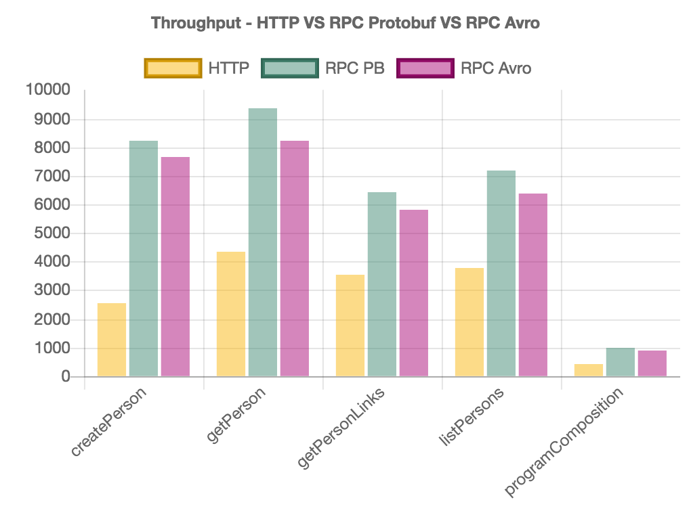
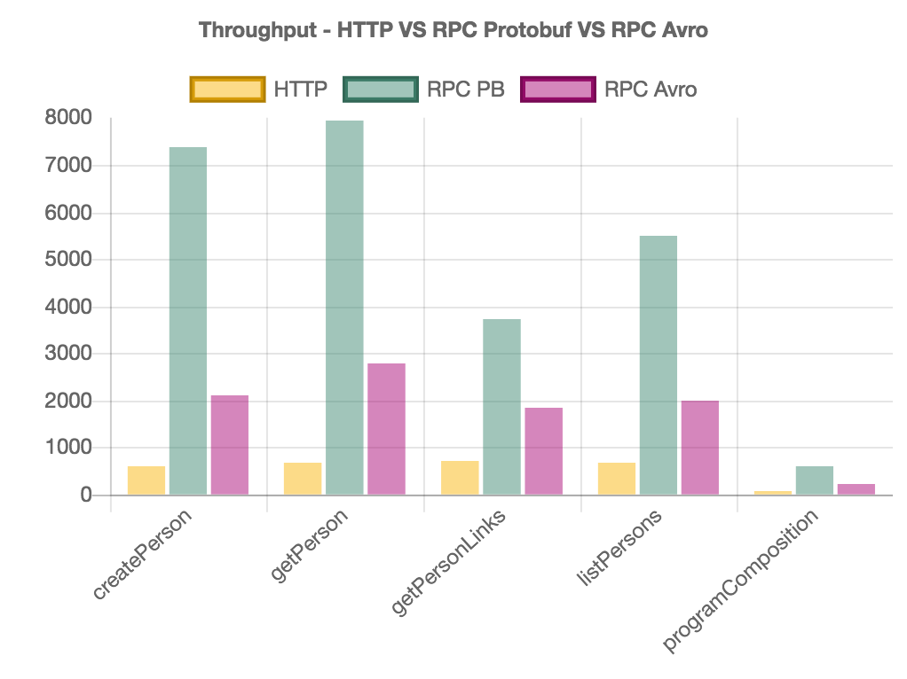
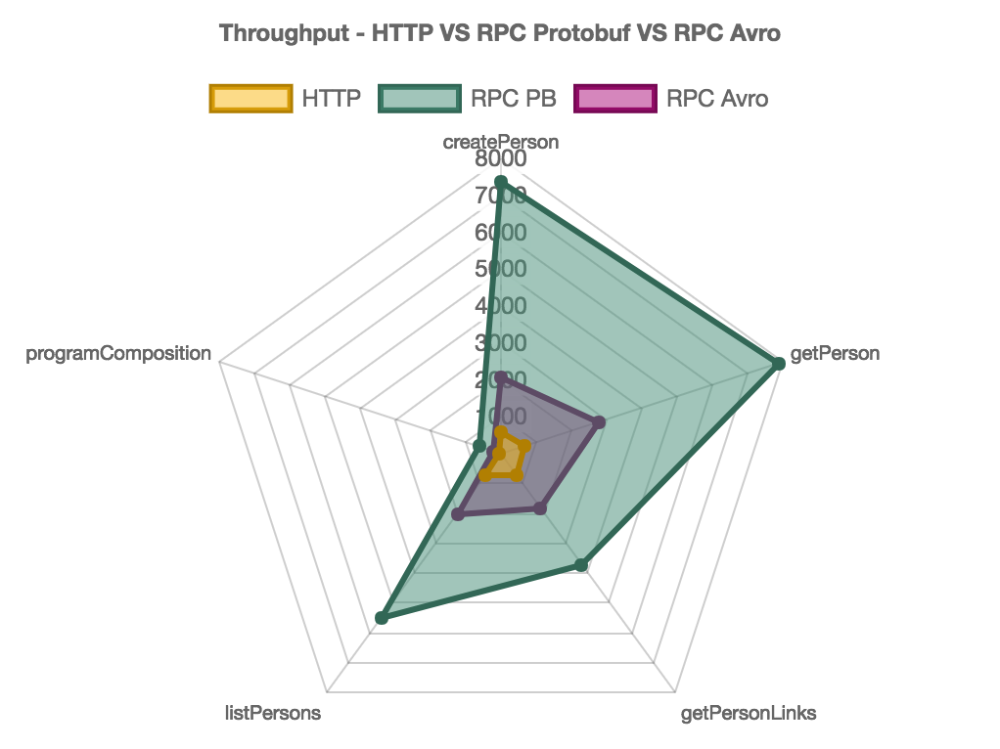

[](https://travis-ci.org/47deg/metrifier)

# metrifier

Comparing `HTTP` against `frees-rpc` services.

<!-- START doctoc generated TOC please keep comment here to allow auto update -->
<!-- DON'T EDIT THIS SECTION, INSTEAD RE-RUN doctoc TO UPDATE -->
**Table of Contents**  *generated with [DocToc](https://github.com/thlorenz/doctoc)*

- [Running Demo](#running-demo)
  - [http](#http)
  - [frees-rpc](#frees-rpc)
    - [frees-rpc Protobuf](#frees-rpc-protobuf)
    - [frees-rpc Avro](#frees-rpc-avro)
- [Running Benchmarks Locally](#running-benchmarks-locally)
  - [HTTP Benchmarks](#http-benchmarks)
  - [frees-rpc Protobuf Benchmarks](#frees-rpc-protobuf-benchmarks)
  - [frees-rpc Avro Benchmarks](#frees-rpc-avro-benchmarks)
- [Running Benchmarks on Google Cloud Platform](#running-benchmarks-on-google-cloud-platform)
  - [Assembling metrifier](#assembling-metrifier)
  - [Uploading jars to Google Cloud Storage](#uploading-jars-to-google-cloud-storage)
  - [Provisioning the Infrastructure](#provisioning-the-infrastructure)
  - [HTTP Benchmarks](#http-benchmarks-1)
    - [Running the Server](#running-the-server)
    - [Running the Benchmarks](#running-the-benchmarks)
  - [frees-rpc Proto Benchmarks](#frees-rpc-proto-benchmarks)
    - [Running the Server](#running-the-server-1)
    - [Running the Benchmarks](#running-the-benchmarks-1)
  - [frees-rpc Avro Benchmarks](#frees-rpc-avro-benchmarks-1)
    - [Running the Server](#running-the-server-2)
    - [Running the Benchmarks](#running-the-benchmarks-2)
- [Benchmark Results](#benchmark-results)
  - [Running Benchmarks Locally](#running-benchmarks-locally-1)
    - [Machine Details](#machine-details)
    - [HTTP vs frees-rpc Protobuf vs frees-rpc Avro](#http-vs-frees-rpc-protobuf-vs-frees-rpc-avro)
    - [Comparing benchmarks one by one](#comparing-benchmarks-one-by-one)
      - [createPerson](#createperson)
      - [getPerson](#getperson)
      - [getPersonLinks](#getpersonlinks)
      - [listPersons](#listpersons)
      - [programComposition](#programcomposition)
    - [Comparing benchmarks in Charts](#comparing-benchmarks-in-charts)
  - [Running Benchmarks on GCP](#running-benchmarks-on-gcp)
    - [Server GCE instance Details](#server-gce-instance-details)
    - [Benchmarks GCE instance Details](#benchmarks-gce-instance-details)
    - [HTTP vs frees-rpc Protobuf vs frees-rpc Avro](#http-vs-frees-rpc-protobuf-vs-frees-rpc-avro-1)
    - [Comparing benchmarks one by one](#comparing-benchmarks-one-by-one-1)
      - [createPerson](#createperson-1)
      - [getPerson](#getperson-1)
      - [getPersonLinks](#getpersonlinks-1)
      - [listPersons](#listpersons-1)
      - [programComposition](#programcomposition-1)
    - [Comparing benchmarks in Charts](#comparing-benchmarks-in-charts-1)
  - [Conclusion](#conclusion)

<!-- END doctoc generated TOC please keep comment here to allow auto update -->

## Running Demo

### http

* Run Server:

```bash
sbt "http/runMain metrifier.http.server.HttpServer"
```

* Run Client:

```bash
sbt "demo/runMain metrifier.demo.HttpDemoApp"
```

By default, host and port will be `localhost` and `8080`, respectively. You can override this configuration through either configuration key or environment variable:

* Host: `http.host` VS `HTTP_HOST`.
* Port: `http.port` VS `HTTP_PORT`.

### frees-rpc

In this case, we will try out with two different of binary serializations: `Protobuf` and `Avro`.

By default, for both cases, the host and the port will be `localhost` and `8080`, respectively. You can override this configuration through either configuration key or environment variable:

* Host: `rpc.host` VS `RPC_HOST`.
* Port: `rpc.port` VS `RPC_PORT`.

#### frees-rpc Protobuf

* Run **Protobuf** based Server:

```bash
sbt "frees-rpc/runMain metrifier.rpc.server.RPCProtoServer"
```

* Run **Protobuf** based Client:

```bash
sbt "demo/runMain metrifier.demo.RPCProtoDemoApp"
```

#### frees-rpc Avro

* Run **Avro** based Server:

```bash
sbt "frees-rpc/runMain metrifier.rpc.server.RPCAvroServer"
```

* Run **Avro** based Client:

```bash
sbt "demo/runMain metrifier.demo.RPCAvroDemoApp"
```

## Running Benchmarks Locally

We are using the [Java Microbenchmark Harness (JMH)](http://openjdk.java.net/projects/code-tools/jmh/) tool, which is helping us to get an experimental answer to a basic question about which implementation executes fastest among:

* HTTP stack based on:
  * `http4s`, version `0.15.12a`.
  * `argonaut`, version `6.2`.
* RPC services stack based on:
  * `freestyle`, version `0.4.2`.
  * `frees-rpc`, version `0.3.0` (atop of [gRPC](https://grpc.io/), version `1.7.0`).

### HTTP Benchmarks

* Run Server:

```bash
sbt "http/runMain metrifier.http.server.HttpServer"
```

* Run Benchmarks:

```bash
sbt "bench/jmh:run -o http-benchmark-results.txt -i 20 -wi 20 -f 2 -t 4 metrifier.benchmark.HttpBenchmark"
```

Which means "20 iterations", "20 warmup iterations", "2 forks", "4 threads".

### frees-rpc Protobuf Benchmarks

* Run Protobuf based Server:

```bash
sbt "frees-rpc/runMain metrifier.rpc.server.RPCProtoServer"
```

* Run Protobuf based Benchmarks:

```bash
sbt "bench/jmh:run -o rpc-proto-benchmark-results.txt -i 20 -wi 20 -f 2 -t 4 metrifier.benchmark.RPCProtoBenchmark"
```

Which means "20 iterations", "20 warmup iterations", "2 forks", "4 threads".

### frees-rpc Avro Benchmarks

* Run Avro based Server:

```bash
sbt "frees-rpc/runMain metrifier.rpc.server.RPCAvroServer"
```

* Run Avro based Benchmarks:

```bash
sbt "bench/jmh:run -o rpc-avro-benchmark-results.txt -i 20 -wi 20 -f 2 -t 4 metrifier.benchmark.RPCAvroBenchmark"
```

Which means "20 iterations", "20 warmup iterations", "2 forks", "4 threads".

## Running Benchmarks on Google Cloud Platform

Before starting detailing how to deploy metrifier to GCP, let's see how to assemble it.

### Assembling metrifier

To make a JAR file containing only the external dependencies, type:

```bash
sbt assemblyPackageDependency
```

Output (assuming we are in the project path):

```bash
bench/target/scala-2.12/metrifier-bench-assembly-[project-version]-deps.jar
demo/target/scala-2.12/metrifier-demo-assembly-[project-version]-deps.jar
frees-rpc/target/scala-2.12/metrifier-frees-rpc-assembly-[project-version]-deps.jar
http/target/scala-2.12/metrifier-http-assembly-[project-version]-deps.jar
shared/target/scala-2.12/metrifier-shared-assembly-[project-version]-deps.jar
```

This is intended to be used with a JAR that only contains your project, so now, you can write:

```bash
sbt assembly
```

And we'll get the following artifacts as the result:

```bash
bench/target/scala-2.12/metrifier-bench-assembly-[project-version].jar
demo/target/scala-2.12/metrifier-demo-assembly-[project-version].jar
frees-rpc/target/scala-2.12/metrifier-frees-rpc-assembly-[project-version].jar
http/target/scala-2.12/metrifier-http-assembly-[project-version].jar
shared/target/scala-2.12/metrifier-shared-assembly-[project-version].jar
```

### Uploading jars to Google Cloud Storage

In this case, we've created a bucket named as `metrifier` within our GCP project. Assuming this name, these would be the set of commands to run (we're skipping the `bench` artifacts since we are not going to use them):

```bash
export METRIFIER_VERSION=0.0.3
gsutil cp demo/target/scala-2.12/metrifier-demo-assembly-${METRIFIER_VERSION}-deps.jar gs://metrifier/jars
gsutil cp frees-rpc/target/scala-2.12/metrifier-frees-rpc-assembly-${METRIFIER_VERSION}-deps.jar gs://metrifier/jars
gsutil cp http/target/scala-2.12/metrifier-http-assembly-${METRIFIER_VERSION}-deps.jar gs://metrifier/jars
gsutil cp shared/target/scala-2.12/metrifier-shared-assembly-${METRIFIER_VERSION}-deps.jar gs://metrifier/jars
gsutil cp demo/target/scala-2.12/metrifier-demo-assembly-${METRIFIER_VERSION}.jar gs://metrifier/jars
gsutil cp frees-rpc/target/scala-2.12/metrifier-frees-rpc-assembly-${METRIFIER_VERSION}.jar gs://metrifier/jars
gsutil cp http/target/scala-2.12/metrifier-http-assembly-${METRIFIER_VERSION}.jar gs://metrifier/jars
gsutil cp shared/target/scala-2.12/metrifier-shared-assembly-${METRIFIER_VERSION}.jar gs://metrifier/jars
```

If the project dependencies have not changed, you could just upload the project JARs:

```bash
export METRIFIER_VERSION=0.0.3
gsutil cp demo/target/scala-2.12/metrifier-demo-assembly-${METRIFIER_VERSION}.jar gs://metrifier/jars
gsutil cp frees-rpc/target/scala-2.12/metrifier-frees-rpc-assembly-${METRIFIER_VERSION}.jar gs://metrifier/jars
gsutil cp http/target/scala-2.12/metrifier-http-assembly-${METRIFIER_VERSION}.jar gs://metrifier/jars
gsutil cp shared/target/scala-2.12/metrifier-shared-assembly-${METRIFIER_VERSION}.jar gs://metrifier/jars
```

### Provisioning the Infrastructure

See [this guide](deploy/README.md) to get information about how to deploy and to provision the different services in [Google Compute Engine](https://cloud.google.com/compute/).

Once everything is up, follow the next sections to run the benchmarks atop GCP.

### HTTP Benchmarks

#### Running the Server

1. SSH into `http-server-vm` instance.
2. Run the HTTP Server:
```bash
export METRIFIER_VERSION=0.0.3
env \
    HTTP_HOST=http-server-vm \
    HTTP_PORT=8080 \
    java -cp \
    /metrifier/jars/metrifier-shared-assembly-${METRIFIER_VERSION}-deps.jar:/metrifier/jars/metrifier-shared-assembly-${METRIFIER_VERSION}.jar:/metrifier/jars/metrifier-http-assembly-${METRIFIER_VERSION}-deps.jar:/metrifier/jars/metrifier-http-assembly-${METRIFIER_VERSION}.jar \
    metrifier.http.server.HttpServer
```

#### Running the Benchmarks

1. SSH into `http-jmh-vm` instance.
2. Run the following `GET` to fetch all the persons (checking connectivity):
```bash
curl "http://http-server-vm:8080/person"
```
3. If step was successful, run the benchmarks:
```bash
export METRIFIER_VERSION=0.0.3
cd /metrifier/repo
env \
    HTTP_HOST=http-server-vm \
    HTTP_PORT=8080 \
    sbt "bench/jmh:run -o /metrifier/bench_results/http-benchmark-results-${METRIFIER_VERSION}.txt -i 20 -wi 20 -f 2 -t 4 metrifier.benchmark.HttpBenchmark"
```

Given the port `8080` was opened to the exterior when deploying the cluster with Google Cloud Manager, you could even run the benchmarks from your local machine, using the external IP address (changing to HTTP_HOST=[HTTP_SERVER_INSTANCE_EXTERNAL_IP]).

### frees-rpc Proto Benchmarks

#### Running the Server

1. SSH into `rpc-proto-server-vm` instance.
2. Run the RPC Protobuf based Server:
```bash
export METRIFIER_VERSION=0.0.3
env \
    RPC_HOST=rpc-proto-server-vm \
    RPC_PORT=8080 \
    java -cp \
    /metrifier/jars/metrifier-shared-assembly-${METRIFIER_VERSION}-deps.jar:/metrifier/jars/metrifier-shared-assembly-${METRIFIER_VERSION}.jar:/metrifier/jars/metrifier-frees-rpc-assembly-${METRIFIER_VERSION}-deps.jar:/metrifier/jars/metrifier-frees-rpc-assembly-${METRIFIER_VERSION}.jar \
    metrifier.rpc.server.RPCProtoServer
```

#### Running the Benchmarks

1. SSH into `rpc-proto-jmh-vm` instance.
2. Run the benchmarks:
```bash
export METRIFIER_VERSION=0.0.3
cd /metrifier/repo
env \
    RPC_HOST=rpc-proto-server-vm \
    RPC_PORT=8080 \
    sbt "bench/jmh:run -o /metrifier/bench_results/rpc-proto-benchmark-results-${METRIFIER_VERSION}.txt -i 20 -wi 20 -f 2 -t 4 metrifier.benchmark.RPCProtoBenchmark"
```

As we mentioned for the Http benchmarks, in this case we could also run the benchmarks from our local machine, using the external IP address (changing to RPC_HOST=[RPC_SERVER_INSTANCE_EXTERNAL_IP]).

### frees-rpc Avro Benchmarks

#### Running the Server

1. SSH into `rpc-avro-server-vm` instance.
2. Run the RPC Avro based Server:
```bash
export METRIFIER_VERSION=0.0.3
env \
    RPC_HOST=rpc-avro-server-vm \
    RPC_PORT=8080 \
    java -cp \
    /metrifier/jars/metrifier-shared-assembly-${METRIFIER_VERSION}-deps.jar:/metrifier/jars/metrifier-shared-assembly-${METRIFIER_VERSION}.jar:/metrifier/jars/metrifier-frees-rpc-assembly-${METRIFIER_VERSION}-deps.jar:/metrifier/jars/metrifier-frees-rpc-assembly-${METRIFIER_VERSION}.jar \
    metrifier.rpc.server.RPCAvroServer
```

#### Running the Benchmarks

1. SSH into `rpc-avro-jmh-vm` instance.
2. Run the benchmarks:
```bash
export METRIFIER_VERSION=0.0.3
cd /metrifier/repo
env \
    RPC_HOST=rpc-avro-server-vm \
    RPC_PORT=8080 \
    sbt "bench/jmh:run -o /metrifier/bench_results/rpc-avro-benchmark-results-${METRIFIER_VERSION}.txt -i 20 -wi 20 -f 2 -t 4 metrifier.benchmark.RPCAvroBenchmark"
```

As above, we could also run the benchmarks from our local machine, using the external IP address (changing to RPC_HOST=[RPC_SERVER_INSTANCE_EXTERNAL_IP]).

## Benchmark Results

We've experimented with two different environments, local (development laptop) and the cloud (GCP).
Expanded version of these results are in: 

* [BENCHMARK_RESULTS_LOCAL.md](results/BENCHMARK_RESULTS_LOCAL.md) file for the local environment.
* [BENCHMARK_RESULTS_GCP.md](results/BENCHMARK_RESULTS_GCP.md) file for the GCP version.

### Running Benchmarks Locally

#### Machine Details

* Model Name: MacBook Pro
* Model Identifier: MacBookPro12,1
* Intel(R) Core(TM) i5-5257U CPU @ 2.70GHz
* Number of Processors: 1
* Total Number of Cores: 2
* L2 Cache (per Core): 256 KB
* L3 Cache: 3 MB
* Memory: 16 GB

#### HTTP vs frees-rpc Protobuf vs frees-rpc Avro

* HttpBenchmark Raw output:

```bash
# Run complete. Total time: 00:08:43

Benchmark                          Mode  Cnt     Score     Error  Units
HttpBenchmark.createPerson        thrpt   40  5159.462 ±  55.083  ops/s
HttpBenchmark.getPerson           thrpt   40  7567.652 ± 154.787  ops/s
HttpBenchmark.getPersonLinks      thrpt   40  5174.368 ±  69.700  ops/s
HttpBenchmark.listPersons         thrpt   40  5821.622 ±  78.599  ops/s
HttpBenchmark.programComposition  thrpt   40   748.383 ±  64.809  ops/s
```

* RPCProtoBenchmark Raw output:

```bash
# Run complete. Total time: 00:09:29

Benchmark                              Mode  Cnt     Score     Error  Units
RPCProtoBenchmark.createPerson        thrpt   40  8203.492 ± 429.421  ops/s
RPCProtoBenchmark.getPerson           thrpt   40  9338.080 ± 317.038  ops/s
RPCProtoBenchmark.getPersonLinks      thrpt   40  6422.018 ± 103.726  ops/s
RPCProtoBenchmark.listPersons         thrpt   40  7182.560 ± 116.855  ops/s
RPCProtoBenchmark.programComposition  thrpt   40   999.718 ±  25.936  ops/s
```

* RPCAvroBenchmark Raw output:

```bash
# Run complete. Total time: 00:09:30

Benchmark                             Mode  Cnt     Score     Error  Units
RPCAvroBenchmark.createPerson        thrpt   40  7636.428 ± 296.527  ops/s
RPCAvroBenchmark.getPerson           thrpt   40  8237.028 ± 254.020  ops/s
RPCAvroBenchmark.getPersonLinks      thrpt   40  5809.542 ± 132.402  ops/s
RPCAvroBenchmark.listPersons         thrpt   40  6359.060 ± 125.067  ops/s
RPCAvroBenchmark.programComposition  thrpt   40   898.127 ±  31.652  ops/s
```

#### Comparing benchmarks one by one

##### createPerson

Source | Mode | Cnt | Score | Error | Units
--- | --- | --- | --- | --- | ---
HttpBenchmark.createPerson | thrpt | 40 | 5159.462 | 55.083 | ops/s
RPCProtoBenchmark.createPerson | thrpt | 40 | 8203.492 | 429.421 | ops/s
RPCAvroBenchmark.createPerson | thrpt | 40 | 7636.428 | 296.527 | ops/s

##### getPerson

Source | Mode | Cnt | Score | Error | Units
--- | --- | --- | --- | --- | ---
HttpBenchmark.getPerson | thrpt | 40 | 7567.652 | 154.787 | ops/s
RPCProtoBenchmark.getPerson | thrpt | 40 | 9338.080 | 317.038 | ops/s
RPCAvroBenchmark.getPerson | thrpt | 40 | 8237.028 | 254.020 | ops/s


##### getPersonLinks

Source | Mode | Cnt | Score | Error | Units
--- | --- | --- | --- | --- | ---
HttpBenchmark.getPersonLinks | thrpt | 40 | 5174.368 | 69.700 | ops/s
RPCProtoBenchmark.getPersonLinks | thrpt | 40 | 6422.018 | 103.726 | ops/s
RPCAvroBenchmark.getPersonLinks | thrpt | 40 | 5809.542 | 132.402 | ops/s


##### listPersons

Source | Mode | Cnt | Score | Error | Units
--- | --- | --- | --- | --- | ---
HttpBenchmark.listPersons | thrpt | 40 | 5821.622 | 78.599 | ops/s
RPCProtoBenchmark.listPersons | thrpt | 40 | 7182.560 | 116.855 | ops/s
RPCAvroBenchmark.listPersons | thrpt | 40 | 6359.060 | 125.067 | ops/s


##### programComposition

Source | Mode | Cnt | Score | Error | Units
--- | --- | --- | --- | --- | ---
HttpBenchmark.programComposition | thrpt | 40 | 748.383 | 64.809 | ops/s
RPCProtoBenchmark.programComposition | thrpt | 40 | 999.718 | 25.936 | ops/s
RPCAvroBenchmark.programComposition | thrpt | 40 | 898.127 | 31.652 | ops/s


#### Comparing benchmarks in Charts

You can find the following charts in [this jsfiddle](http://jsfiddle.net/juanpedromoreno/sjw5jgrj/).

* Bar Chart


* Radar Chart


### Running Benchmarks on GCP

We are implementing two Google Compute Engine instances, one for the server (`n1-standard-2`), another one for the benchmarks (`n1-standard-1`). See [Google Docs - Machine Types](https://cloud.google.com/compute/docs/machine-types) for deeper information.

#### Server GCE instance Details

* n1-standard-2.
* 2 virtual CPUs.
* 7.5 GB of memory.

#### Benchmarks GCE instance Details

* n1-standard-1.
* 1 virtual CPU.
* 3.75 GB of memory.

#### HTTP vs frees-rpc Protobuf vs frees-rpc Avro

* HttpBenchmark Raw output:

```bash
# Run complete. Total time: 00:07:13

Benchmark                          Mode  Cnt     Score     Error  Units
HttpBenchmark.createPerson        thrpt   40  2792.105 ± 126.448  ops/s
HttpBenchmark.getPerson           thrpt   40  2955.287 ± 139.535  ops/s
HttpBenchmark.getPersonLinks      thrpt   40  2029.031 ± 124.303  ops/s
HttpBenchmark.listPersons         thrpt   40  2569.887 ± 167.753  ops/s
HttpBenchmark.programComposition  thrpt   40   318.553 ±  20.476  ops/s
```

* RPCProtoBenchmark Raw output:

```bash
# Run complete. Total time: 00:07:14

Benchmark                              Mode  Cnt      Score     Error  Units
RPCProtoBenchmark.createPerson        thrpt   40   9146.401 ± 453.402  ops/s
RPCProtoBenchmark.getPerson           thrpt   40  10290.595 ± 560.968  ops/s
RPCProtoBenchmark.getPersonLinks      thrpt   40   4887.600 ± 439.472  ops/s
RPCProtoBenchmark.listPersons         thrpt   40   6178.998 ± 433.640  ops/s
RPCProtoBenchmark.programComposition  thrpt   40    946.742 ±  36.521  ops/s
```

* RPCAvroBenchmark Raw output:

```bash
# Run complete. Total time: 00:07:11

Benchmark                             Mode  Cnt      Score     Error  Units
RPCAvroBenchmark.createPerson        thrpt   40   9843.557 ± 700.599  ops/s
RPCAvroBenchmark.getPerson           thrpt   40  11405.711 ± 568.813  ops/s
RPCAvroBenchmark.getPersonLinks      thrpt   40   5146.870 ± 579.186  ops/s
RPCAvroBenchmark.listPersons         thrpt   40   6861.396 ± 581.859  ops/s
RPCAvroBenchmark.programComposition  thrpt   40    949.810 ±  83.805  ops/s
```

#### Comparing benchmarks one by one

##### createPerson

Source | Mode | Cnt | Score | Error | Units
--- | --- | --- | --- | --- | ---
HttpBenchmark.createPerson | thrpt | 40 | 2792.105 | 126.448 | ops/s
RPCProtoBenchmark.createPerson | thrpt | 40 | 9146.401 | 453.402 | ops/s
RPCAvroBenchmark.createPerson   | thrpt | 40 | 9843.557 | 700.599| ops/s

##### getPerson

Source | Mode | Cnt | Score | Error | Units
--- | --- | --- | --- | --- | ---
HttpBenchmark.getPerson | thrpt | 40 | 2955.287 | 139.535 | ops/s
RPCProtoBenchmark.getPerson | thrpt | 40 | 10290.595 | 560.968| ops/s
RPCAvroBenchmark.getPerson | thrpt | 40 | 11405.711 | 568.813| ops/s

##### getPersonLinks

Source | Mode | Cnt | Score | Error | Units
--- | --- | --- | --- | --- | ---
HttpBenchmark.getPersonLinks | thrpt | 40 | 2029.031 | 124.303 | ops/s
RPCProtoBenchmark.getPersonLinks | thrpt | 40 | 4887.600 | 439.472| ops/s
RPCAvroBenchmark.getPersonLinks | thrpt | 40 | 5146.870 | 579.186| ops/s

##### listPersons

Source | Mode | Cnt | Score | Error | Units
--- | --- | --- | --- | --- | ---
HttpBenchmark.listPersons | thrpt | 40 | 2569.887 | 167.753 | ops/s
RPCBenchmark.listPersons | thrpt | 40 | 8224.560 | 613.983 | ops/s
RPCAvroBenchmark.listPersons | thrpt | 40 | 6861.396 | 581.859| ops/s

##### programComposition

Source | Mode | Cnt | Score | Error | Units
--- | --- | --- | --- | --- | ---
HttpBenchmark.programComposition | thrpt | 40 | 318.553 |  20.476 | ops/s
RPCProtoBenchmark.programComposition | thrpt | 40 | 946.742 |  36.521| ops/s
RPCAvroBenchmark.programComposition | thrpt | 40 | 949.810 |  83.805| ops/s

#### Comparing benchmarks in Charts

You can find the following charts in [this jsfiddle](http://jsfiddle.net/juanpedromoreno/sjw5jgrj/).

* Bar Chart


* Radar Chart



### Conclusion

Using JMH, we have checked out quickly the performance characteristics for both service architectures trying out in two different ecosystems:

* Local Environment
* GCP Environment

As we have seen, the RPC solution in this case is noticeably faster. Moreover, when network traffic enters the scene, the differences between both are bigger.
